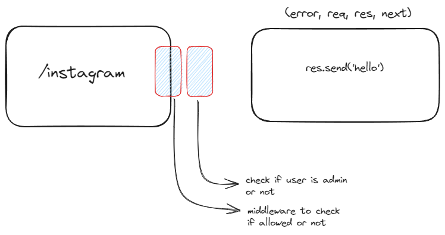
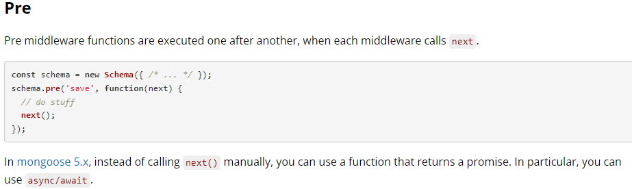
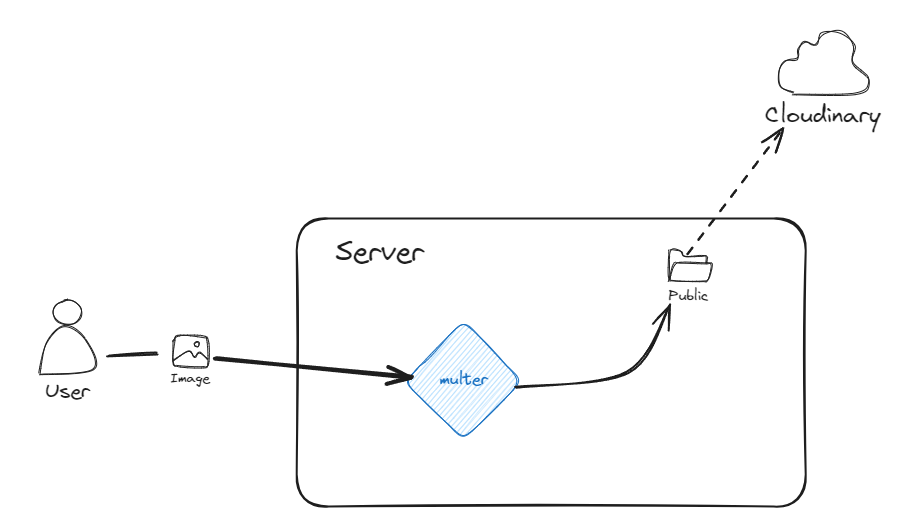

# Let's do some Professional Grade work here now!

This is a backend sereies project.

- [Model Link](https://app.eraser.io/workspace/YtPqZ1VogxGy1jzIDkzj)

### Middlewares



### mongoose Pre hook



### generation of jwt secret

```
requrie('crypto').randomBytes(64).toString('hex')
```

### Multer + Cloudinary file upload



### how access Token and refresh token works


